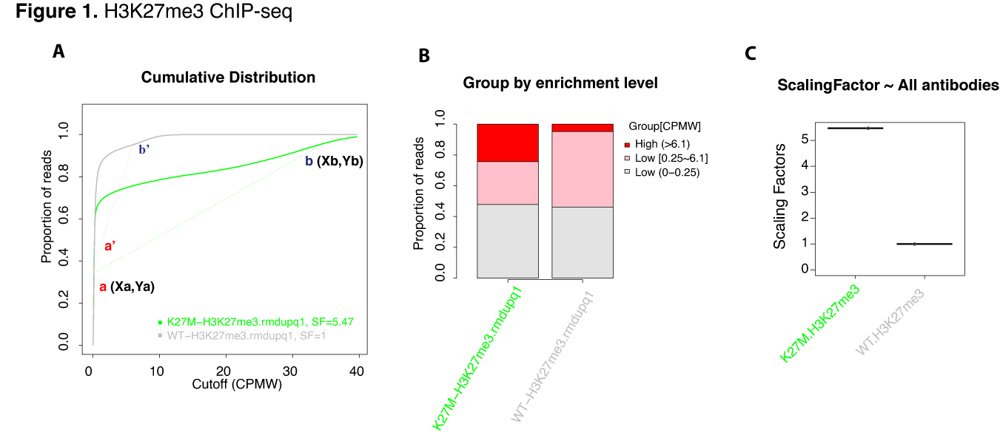

## ChIPseqSpikeInFree

A Spike-in Free ChIP-Seq Normalization Approach for Detecting Global Changes in Histone Modifications

## Background

Traditional reads per million (RPM) normalization method is inappropriate for the evaluation of ChIP-seq data when the treatment or mutation has the global effect. Changes in global levels of histone modifications can be detected by using exogenous reference spike-in controls. However, most of the ChIP-seq studies have overlooked the normalization problem that have to be corrected with spike-in. A method that retrospectively renormalize data sets without spike-in is lacking. 

We develop `ChIPseqSpikeInFree`, a novel ChIP-seq normalization method to effectively determine scaling factors for samples across various conditions and treatments, which does not rely on exogenous spike-in chromatin or peak detection to reveal global changes in histone modification occupancy. This method is capable of revealing the similar magnitude of global changes as the spike-in method.

## Prerequisites

`ChIPseqSpikeInFree` depends on `Rsamtools`, `GenomicRanges`, and `GenomicAlignments` to count reads from bam files.

To install these packages, start `R` (version "3.4") and enter:
```R
> source("https://bioconductor.org/biocLite.R")
> biocLite("Rsamtools")
> biocLite("GenomicRanges")
> biocLite("GenomicAlignments")
```

If you use `R` (version "3.5"), enter:
```R
> if (!requireNamespace("BiocManager", quietly = TRUE))
>     install.packages("BiocManager")
> BiocManager::install("Rsamtools")
> BiocManager::install("GenomicRanges")
> BiocManager::install("GenomicAlignments")
```

## Installation

Using `R`, enter:

```R
# Install this package from GitHub
> install.packages("devtools")
> library(devtools)
> install_github("stjude/ChIPseqSpikeInFree")

```

If you wish to build and install this package from source:

```bash
$ git clone https://github.com/stjude/ChIPseqSpikeInFree.git
$ R CMD build ChIPseqSpikeInFree
$ R CMD install ChIPseqSpikeInFree
```

### Usage

A simple workflow in `R` environment.

##### 0. Load package

```R
> library("ChIPseqSpikeInFree")
```

##### 1. Generate `sample_meta.txt` (**tab-delimited txt file with header line**) as follows

Save as `/your/path/sample_meta.txt` ([Example](docs/sample_meta.txt))

| ID                        | ANTIBODY | GROUP |
| ------------------------- | -------- | ----- |
| WT-H3K27me3.rmdupq1.bam   | H3K27me3 | WT    |
| K27M-H3K27me3.rmdupq1.bam | H3K27me3 | K27M  |
| WT-INPUT.rmdupq1.bam      | INPUT    | WT    |
| K27M-INPUT.rmdupq1.bam    | INPUT    | K27M  |

**Note:** INPUT samples are not required at all for a valid metadata file. 

```R
> metaFile <- "/your/path/sample_meta.txt"
```

##### 2. Assign bam file names to a vector

```R
> bams <- c("WT-H3K27me3.rmdupq1.bam","K27M-H3K27me3.rmdupq1.bam")
```

##### 3. Run `ChIPseqSpikeInFree` pipeline (when your bam files correspond to the human reference hg19)

```R
> ChIPseqSpikeInFree(bamFiles = bams, chromFile = "hg19", metaFile = metaFile, prefix = "test")
```

### Input

In the simple usage scenario, the user should have ChIP-seq bam files ready. Sample information can be specified in a metadata file (`metaFile`) and the user should choose a correct reference genome corresponding to the bams.

##### 1. bamFiles: a vector of bam filenames

User should follow ChIP-seq guidelines suggested by `ENCODE consortium(Landt, et al., 2012)` and check the data quality first. Some steps to check quality and prepare ChIP-seq bam files for `ChIPseqSpikeInFree` normalization:

* run SPP tool (Marinov, et al., 2014) to do ChIP-seq data QC and use samples with **Qtag >= 1**
* **remove spike-in reads** from your bam files
* only use **good-quality or uniquely-mapped reads** your bam files
	```bash
	java -jar picard.jar MarkDuplicates \
	      I=input.bam \
	      O=rmdup.bam \
	      M=rmdup_metrics.txt\
	      CREATE_INDEX=true \
              ASSUME_SORTED=false \
              REMOVE_DUPLICATES=true"
	samtools view -hb -q 1  rmdup.bam > rmdupq1.bam
	```
* bam files must **contain a header section** and an alignment section
	```bash
	samtools view -H rmdupq1.bam
	```

##### 2. chromFile: chromosome sizes of reference genome.
`hg19`, `mm9`, `mm10`, `hg19` are included in the package.

For other genomes, you can either:

* Use `fetchChromSizes` to get it from UCSC, but not all genomes are available.

    `http://hgdownload.soe.ucsc.edu/goldenPath/${DB}/bigZips/${DB}.chrom.sizes`  
    Replace `${DB}` with reference genome

* Generate directly from `fasta` file (Linux)
    ```bash
    $ samtools faidx genome.fa
    $ cut -f1,2 genome.fa.fai > genome.chrom.sizes
    ```

##### 3. metaFile: A tab-delimited text file **having three columns with a header line: `ID`, `ANTIBODY`, and `GROUP`**.

* `ID` is the bam file name of ChIP-seq sample that will be included for analysis.
* `ANTIBODY` represents antibody used for ChIP.
* `GROUP` describes the biological treatment or condition of this sample.

### Output

After you successfully run following `ChIPseqSpikeInFree` pipeline:
```R
> ChIPseqSpikeInFree(bamFiles = bams, chromFile = "hg19", metaFile = metaFile, prefix = "test")
```

Output will include: (in case that you set `prefix ="test"`)
1. `test_SF.txt` - text result (see [Interpretation section](#Interpretation-of-scaling-factor-table) or [text file](docs/test_SF.txt))
    * tab-delimited text format, a table of calculated scaling factors by pipeline
2. `test_distribution.pdf` - graphical result (see [Figure 1.A,B](#Graphical-results) or [PDF file](docs/test_distribution.pdf))
    * view of proportion of reads below the given CPMW based on `test_parsedMatrix.txt`
3. `test_boxplot.pdf` - graphical result  (see [Figure 1.C](#Graphical-results) or [PDF file](docs/test_boxplot.pdf))
    * view of scaling factors as boxplot based on `test_SF.txt`
4. `test_rawCounts.txt` - intermediate file
    * tab-delimited text format, a table of raw read counts for each 1kb bin across genome
5. `test_parsedMatrix.txt` - intermediate file
    * tab-delimited text format, a table of proportion of reads below given cutoffs (CPMW)
### Interpretation of scaling factor table  

|    ID                     | GROUP | ANTIBODY | COLOR | QC                                             | SF    |	TURNS                  |
| ------------------------- | ----- | -------- | ----- | ---------------------------------------------- | ----- | ------------------------ |
|WT-H3K27me3.rmdupq1.bam    | WT    | H3K27me3 | grey  | pass                                           | 1     |  0.25,0.3817,6.1,0.9523  |
|K27M-H3K27me3.rmdupq1.bam  | K27M  | H3K27me3 | green | pass                                           | 5.47  |  0.2,0.3429,34.7,0.9585  |
|WT-INPUT.rmdupq1.bam       | WT    | INPUT    | black | fail: complete loss, input or poor enrichment  | NA    |  0.2,0.1860,0.7,0.9396   |
|K27M-INPUT.rmdupq1.bam     | K27M  | INPUT    | grey  | fail: complete loss, input or poor enrichment  | NA    |  0.15,0.0675,0.35,0.8476 |

- **COLOR**: defines color for each sample in cumulative distribution curve `*_distribution.pdf`
- **QC**: quality control testing. QC failure indicates poor or no enrichment. 
- **SF**: scaling factor. Only sample that passes QC will be given a SF and **NA** indicates sample with poor enrichment. Input sample is not required for SF calculation. Larger scaling factor indicates a lower level of total histone mark and vice versa. For example, H3K27me3 is globally decreased in H3.3 K27M cells compared to WT  (**SF, 5.47 vs 1**). 
- **TURNS**: the coordinates of two points [Xa, Ya, Xb, Yb] detected in cumulative distribution plot (proportion of reads below CPMW cutoffs) for slope-based SF calculation. 
### Graphical results


## Notes

This repository contains the following:
- source code
- documentation [[PDF file](docs/ChIPseqSpikeInFree_1.2.2.pdf)]
- chromFile of human and mouse reference genome (`hg19`, `mm9`, `mm10`, and `hg38`)
- an example of `sample_meta.txt`

Users will still need to source and provide the following:
- bam files
- `sample_meta.txt`
- chromFile except `hg19`, `mm9`, `mm10`, and `hg38`

## Maintainers

* [Hongjian Jin]

[Hongjian Jin]: https://github.com/hongjianjin
